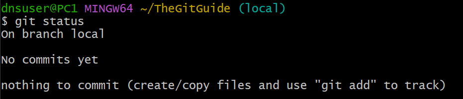
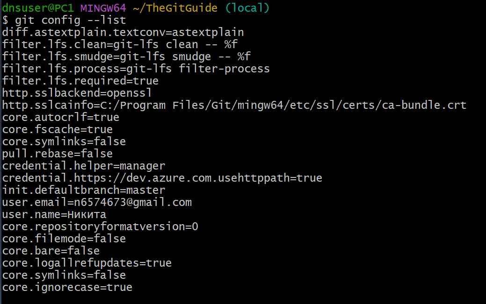
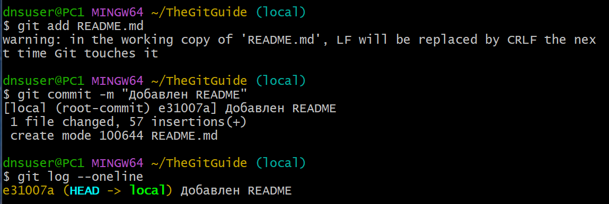

# Инструкция по работе с GIT

## Структура документа
Документ разбит на главы:

- Установка Git  
- Работа с локальным Git  
  - Первоначальная настройка  
  - Основные команды  
  - Работа с ветками  
- Как добавлять скриншоты в инструкцию  

---

## 1. Установка Git

1. Перейдите на официальный сайт: [https://git-scm.com/download/win](https://git-scm.com/download/win)  
2. Скачайте установщик под вашу операционную систему (Windows, macOS, Linux)  
3. Запустите файл и нажимайте **Next** на всех шагах  
4. В конце установки поставьте галочку **Git Bash Here** (для Windows)  
5. Готово — Git установлен.

---

## 2. Работа с локальным Git

### Первоначальная настройка Git
```
git checkout -b local #создание ветки local


```
Эти настройки нужны, чтобы ваши коммиты подписывались правильным именем и email.

```bash
git config --list                 # посмотреть все текущие настройки
git config --global user.name "твоё имя"   # задать имя для коммитов
git config --global user.email "твой email" # задать email

```
Добавляем новый файл - README.md


```echo "# Мой проект" > README.md```

Добавляем его в staging

```git add README.md```

Делаем коммит и смотрим историю

``` 
git commit -m "Добавлен README"

git log --oneline

```
